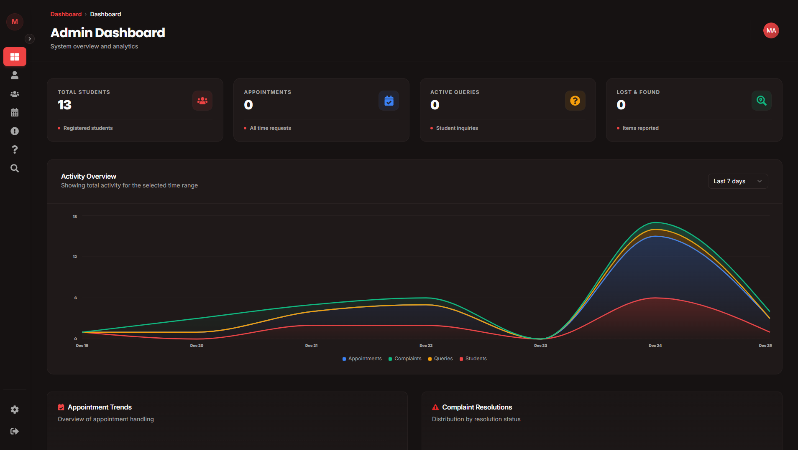
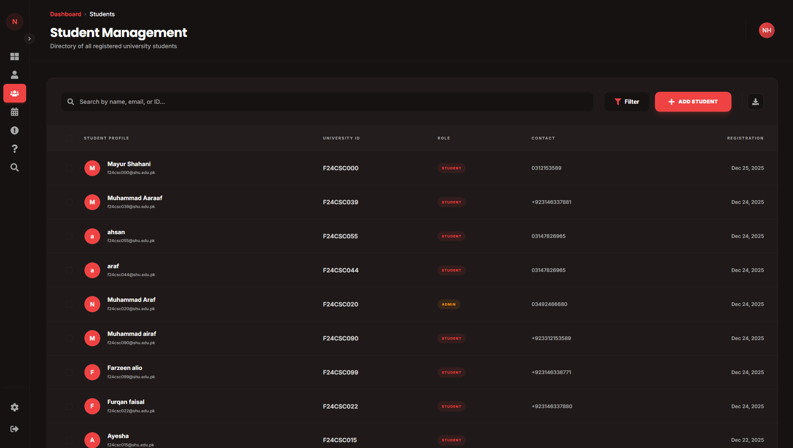
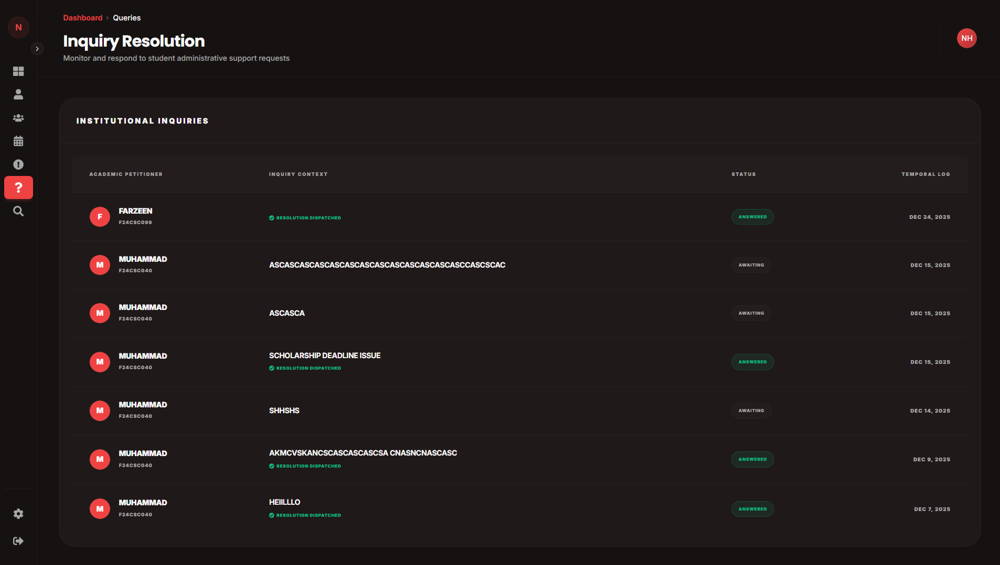
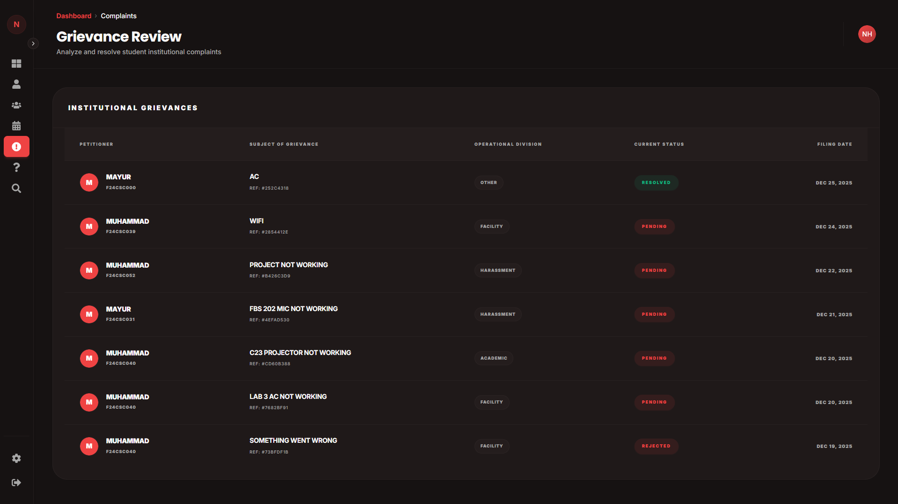
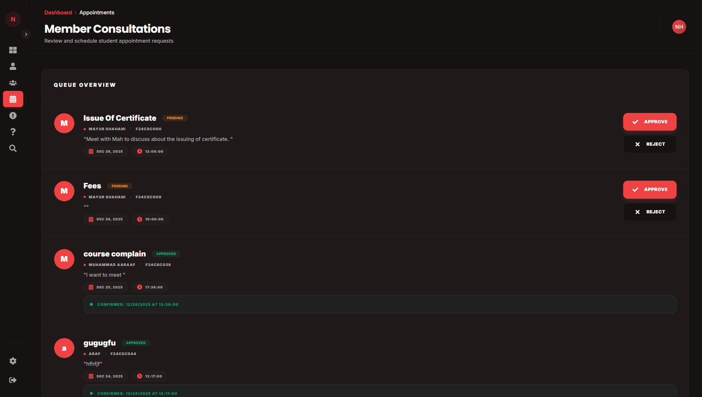
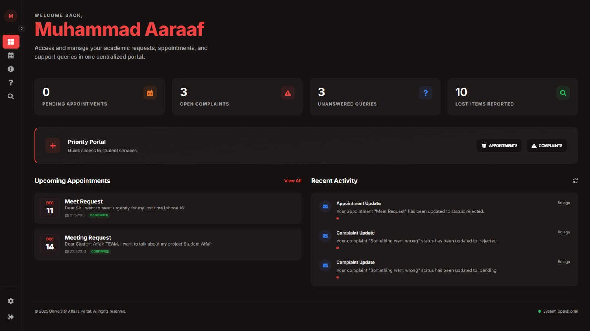
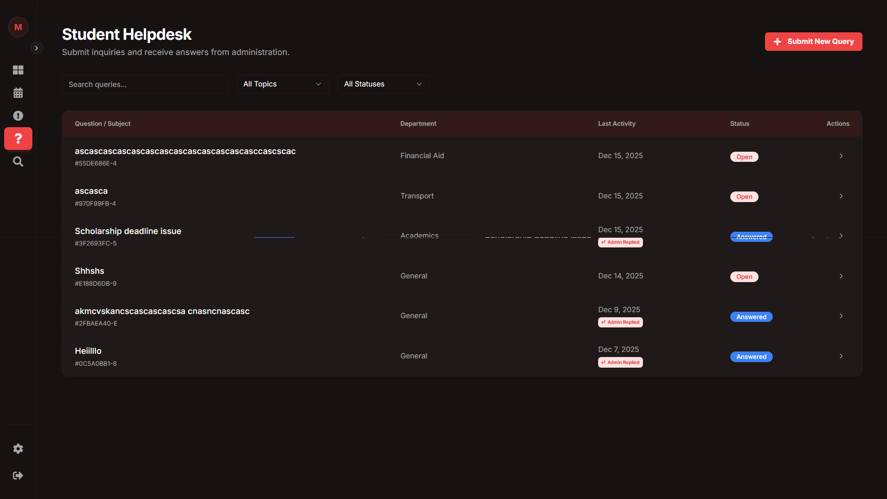

# Student Affair

Live Website: https://shuaffair.vercel.app/

Student Affair is a full-stack web application designed for Salim Habib University to manage Student Lost & Found, Queries, Appointments, Complains and student administrative services  
The system provides a centralized platform where students and administration can interact in a transparent, structured, and secure way.

This project is built as a real-world university system, not a demo project.

---

## Project Description

Universities often handle lost items, student complaints, queries, and appointments manually.  
This causes delays, missing records, and no historical tracking.

Student Affair solves this problem by providing a digital Student Affairs Portal where:

- Students report lost or found items using their official Student ID
- Admin can analyze student activity and monthly data
- Queries, complaints, and appointments are handled in one system
- All records are stored securely and permanently

Each student is identified using their university-issued ID (example: F24CSC039).

---

## Student Features

### Identity-Based Access
- Students use their official Student ID
- Student name and ID are visible on posts for authenticity

### Queries
- Students can submit queries to Student Affairs
- Each query has a unique reference
- Admin replies are stored and visible to students

### Complaints
- Students can submit complaints
- Complaint status tracking (pending or resolved)

### Appointments
- Students can request appointments with admin
- Admin approves and assigns time and date

---

## Admin Features

### Dashboard
- Monthly lost and found statistics
- Overview of student activities like appoinment queries and complains

### Student Analysis
- Search by Student ID
- View how many times a student lost or found items
- Long-term student activity tracking

### Query Management
- View and reply to student queries
- Track resolution status

### Complaint Management
- Review and resolve complaints

### Appointment Management
- Approve or reject appointment requests
- Assign official meeting time

---

## Technology Stack

### Frontend
- Next.JS
- Tailwind CSS

### Backend and Database
- Supabase
- PostgreSQL
- Authentication
- Row Level Security (RLS)

### Deployment
- Vercel

---

## Website Screenshots

## Website Screenshots

Below are screenshots of the Student Affair web application, including both student and admin panels.

### Admin Dashboard

### Admin – Student Management

### Admin – Queries Management

### Admin – Complaints Management

### Admin – Appointments Management

---

### Student Dashboard

### Student – Query Page

---

## Security

- Secure authentication and authorization
- Role-based access (student and admin)
- Row Level Security policies

---

## Future Improvements

- Mobile application
- AI-based item matching

---

## Author

Muhammad Araf 
Full Stack Developer
BS Computer Science  
Salim Habib University  
Student ID: F24CSC039

---

## License

This project is for read Only
